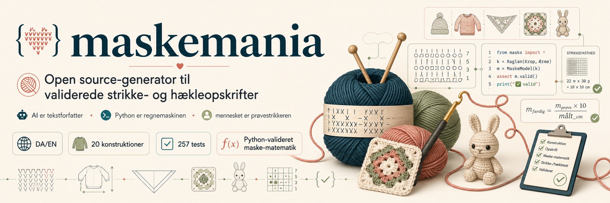

<p align="center"></p>

# maskemania

Skriv dine mål, dit garn, og din maskeprøve — få en strikke- eller hækleopskrift
hvor tallene går op, layoutet er print-klar, og garnet aldrig løber tør tre rækker
før toppen. På dansk eller engelsk. Helt gratis.

## Hvad er det?

Maskemania er en lille værktøjskasse til strikkere og hæklere der gerne vil
designe deres egen opskrift uden at skulle vente på at nogen anden laver den
først. Du fortæller den hvor stor en hue skal være, hvad din maskeprøve viser,
og hvilket garn du har liggende — og så regner den ud hvor mange masker du
skal slå op, hvor mange omgange ribkant der er naturligt, hvornår indtagningerne
skal sætte ind, og hvornår du trækker tråden gennem de sidste masker.

Lige nu kan den lave 20 forskellige konstruktioner: huer, tørklæder, sweatre,
sokker, sjaler, granny squares, corner-to-corner-tæpper, amigurumi-kaniner,
mandalaer, og en del mere. Hver opskrift kommer med materialeliste, schematic,
forkortelses-tabel og — hvis du gider — et lille forord til opskriften.

## Hvorfor er den værd at prøve?

ChatGPT og Claude kan ikke regne. De kan godt skrive en opskrift der **lyder**
overbevisende, men maskeantallene er typisk lidt skæve — ribkanten ender på
et ulige tal, indtagningerne går ikke op, du mangler 7 masker når du når
toppen. Maskemania bruger AI til selve teksten omkring opskriften, men al
matematikken kommer fra Python-kode der dobbelttjekker hver eneste række og
omgang. Hvis tallene ikke går op, kommer opskriften ikke ud af maskinen.
Du får simpelthen ikke en opskrift med fejl.

## Sådan kommer du i gang

Maskemania kører i et terminalvindue. På Mac er det allerede installeret;
på Windows kan du bruge Windows Terminal eller WSL.

```bash
# 1) Hent koden
git clone https://github.com/mikkelkrogsholm/maskemania.git
cd maskemania

# 2) En hue, hovedomkreds 56 cm, gauge 22 m / 30 p på 10 cm, Drops Air
python3 skills/strikning/scripts/generate.py --format md hue \
  --head 56 --sts 22 --rows 30 --garn "Drops Air"

# 3) En granny-firkant på 6 omgange
python3 skills/hækling/scripts/generate.py --format md granny --rounds 6
```

Vil du have opskriften som print-klar PDF? Tilføj `--pdf hue.pdf` til
kommandoen. (Det kræver [WeasyPrint](https://weasyprint.org/) installeret:
`pip install weasyprint`.)

### De flag du oftest skal bruge

| Det du vil sige | Flag |
|---|---|
| Hovedomkreds | `--head 56` |
| Brystmål | `--bust 94` |
| Bredde og længde i cm | `--width 30 --length 180` |
| Maskeprøve: masker pr. 10 cm | `--sts 22` |
| Maskeprøve: pinde pr. 10 cm | `--rows 30` |
| Garn (auto-fylder gauge fra databasen) | `--garn "Drops Air"` |
| Børnestørrelse | `--age 6-12M` (eller `0-3M`, `1-2y`, `4-6y` …) |
| Skift til engelsk | `--lang en` |
| Foreslå garn-alternativer | `--substitut` |

Hvis du foretrækker danske flag-navne, virker `--bryst`, `--bredde`,
`--længde`, `--hovedmål`, `--fodlængde`, `--ærme` osv. også.

## Hvad kan den lave?

### Strikning

| Hvad | Sværhedsgrad | Subcommand |
|---|---|---|
| Hue | Begynder | `hue` |
| Tørklæde | Begynder | `tørklæde` |
| Top-down raglan-sweater | Let øvet | `raglan` |
| Bottom-up sweater | Let øvet | `sweater` |
| Sokker (top-down med hæl + gusset) | Øvet | `sokker` |
| Compound raglan | Øvet | `compound-raglan` |
| Half-pi sjal (Zimmermann) | Øvet | `half-pi` |
| Crescent-sjal med korte rækker | Øvet | `short-rows` |
| Lace-sjal (feather and fan) | Øvet | `lace` |
| Stranded yoke (islandsk stil) | Avanceret | `yoke-stranded` |
| Colorwork-prøvelap | Let øvet | `colorwork` |

### Hækling

| Hvad | Sværhedsgrad | Subcommand |
|---|---|---|
| Amigurumi-kugle | Begynder | `amigurumi` |
| Amigurumi-cylinder | Begynder | `cylinder` |
| Amigurumi-figur (bjørn eller kanin) | Let øvet | `figur` |
| Granny square | Begynder | `granny` |
| Hæklet tørklæde | Begynder | `tørklæde` |
| Filet (pixel-mønster) | Let øvet | `filet` |
| C2C-tæppe (corner to corner) | Let øvet | `c2c` |
| Mandala | Øvet | `mandala` |
| Tunisian (TSS) | Øvet | `tunisian` |

## Praktiske finesser

**Garn-database.** 22 garn fra Drops, Sandnes, Önling, Hobbii, Cascade og
Rowan er allerede sat ind med deres typiske gauge, pinde-/hæklenål-størrelse
og garnløb. Skriver du `--garn "Drops Air"`, fyldes resten automatisk ud,
så du kun behøver angive dine egne mål.

**Børnestørrelser.** `--age 6-12M` (eller `0-3M`, `1-2y`, `2-4y` op til
`10-12y`) auto-fylder hovedomkreds, brystmål og fodlængde efter de typiske
nordiske strikketabeller.

**Garn-alternativer.** Tilføj `--substitut`, og opskriften kommer med en
boks med 3-5 alternative garn i samme tykkelse — dejligt når dit yndlingsgarn
ikke længere produceres, eller du vil bruge noget du har på lager.

**Strikkeklub-mode.** Skal du designe individuelle opskrifter til en hel
strikkeklub? Saml jeres mål i et regneark, eksportér som CSV, og kør
`python3 scripts/strikkeklub.py jer.csv --out klub2026`. Du får en mappe
med en personlig PDF til hver person plus et oversigts-index.

**Sociale forhåndsvisninger.** `--social square hue.png` laver et 1080×1080
billede du kan dele på Instagram. `--social story` laver 9:16-formatet til
Stories og TikTok.

**Dansk og engelsk.** Skift sprog med `--lang en`. Hele opskriften oversættes
— også selve trin-for-trin-instruktionerne.

## En note om livet før test-strikning

Alle 20 konstruktioner er matematisk validerede — alle masker går op. Men
ingen af dem er endnu prøvestrikket eller prøvehæklet i den virkelige verden.
Hvis du strikker eller hækler en af dem og oplever at den færdige ting afviger
mere end 2-3 cm fra hvad opskriften lover, så fortæl os det —
[åbn et issue](https://github.com/mikkelkrogsholm/maskemania/issues) med
billede og mål, og vi retter generatoren. Test-strikkere og test-hæklere er
den mest værdifulde form for bidrag, og vi tager imod jer med kyshånd.

## Krav

- Python 3.10 eller nyere (følger med Mac; gratis download til Windows fra
  python.org).
- En terminal. Mac: Terminal.app eller iTerm2. Windows: Windows Terminal
  eller WSL.
- Valgfrit: `pip install weasyprint` for direkte PDF-eksport.

Ingen pip-pakker krævet for selve opskrifts-genereringen — det hele kører
på Python's standardbibliotek.

## Bidrage

Vil du tilføje en ny konstruktion, et nyt garn til databasen, eller hjælpe med
at finpudse de danske og engelske templates? Læs
[`CONTRIBUTING.md`](CONTRIBUTING.md). Den vigtigste regel er enkel:

> AI digter aldrig maskeantal. Al matematik kommer fra Python — eller direkte
> fra dig.

## Licens

MIT — du må bruge, ændre og dele frit, også kommercielt. Se
[`LICENSE`](LICENSE).
