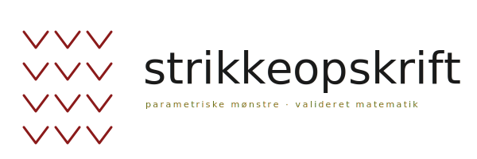

<p align="center">
  
</p>

<p align="center">
  <em>Skriv et tal. Få en strikkeopskrift.</em>
</p>

<p align="center">
  <a href="LICENSE"></a>
  
  
</p>

---

## Hvad du får

Du indtaster din strikkefasthed og dine mål. Du får en færdig opskrift på
dansk — printbar PDF med skematikker, måltabel, opskrifts-trin, krone-
diagram og forkortelses-liste. Hver eneste maske er regnet ud, ikke gættet.

**Konkret:**

- En **PDF i publikations-kvalitet** med forside, skematikker og typografi
  der ligner det du køber hos PetiteKnit eller Önling
- **Dimensions-skematikker** så du kan se hvad du strikker, ikke bare læse om det
- **Måltabel** med færdige mål, ease, bærestykke-dybde, ærmelængde — alt
- **Krone-diagram** til huer (visuelt, ikke kun tal)
- **Fit-advarsler** når dine input giver problemer (fx for smal hals,
  for aggressiv ærme-tapering, eller bærestykke for lavt til over-armen)
- **Dansk strikkesprog** ud af æsken med en forkortelses-liste i hver
  opskrift (fordi danske forkortelser ikke er standardiserede)

---

## Konstruktioner v1

| Plagtype | Status | Bemærkninger |
|---|---|---|
| **Hue** | ✅ | Bottom-up, 8-sektor krone, 2×2 rib |
| **Tørklæde** | ✅ | Flat, valgfri mønsterrapport, retstrik-kanter |
| **Top-down raglan-trøje** | ✅ | EZ-stil med moderne fit-tilpasninger |

**Ikke understøttet endnu:** lace, flerfarvet bærestykke, top-down med
formet hals (Contiguous, ESJ), bottom-up sweatre, sokker, snoninger med
forskudt rapport. Se [CONTRIBUTING.md](CONTRIBUTING.md) for hvad vi
mangler — bidrag er meget velkomne.

---

## Sådan installerer du

### Som agent skill

Hvis du bruger en agent (Claude Code, eller andet der følger
[Agent Skills](https://agentskills.io)-standarden):

```bash
# Personlig — tilgængelig på tværs af projekter
ln -s "$(pwd)/skills/strikning" ~/.claude/skills/strikning

# Eller projekt-specifik
mkdir -p .claude/skills
ln -s "$(pwd)/skills/strikning" .claude/skills/strikning
```

Så kan du bare bede agenten om en strikkeopskrift på dansk.

### Som CLI-værktøj direkte

```bash
cd skills/strikning

# Markdown-output (tekst)
python3 scripts/generate.py --format md hue \
  --head 56 --sts 22 --rows 30 --ease -3

# Pæn HTML/PDF-klar (kræver Chrome til print)
python3 scripts/generate.py --format html --out /tmp/min-hue.html \
  --name "Min hue" hue --head 56 --sts 22 --rows 30 --ease -3
open /tmp/min-hue.html   # i Chrome → Print → Save as PDF

# JSON for programmatisk brug
python3 scripts/generate.py --format json hue \
  --head 56 --sts 22 --rows 30 --ease -3
```

Brug `python3 scripts/generate.py --help` for fuld dokumentation.

---

## Eksempler

### En enkel hue

```bash
python3 scripts/generate.py --format html --out hue.html \
  --name "Søndags-hue" hue \
  --head 56 \         # hovedomkreds
  --sts 22 --rows 30 \  # din strikkefasthed pr. 10 cm
  --ease -3           # negativ ease = strammere fit
```

### En top-down raglan

```bash
python3 scripts/generate.py --format html --out trøje.html \
  --name "Hverdagstrøje" raglan \
  --bust 94 \         # brystmål
  --sts 22 --rows 30 \  # gauge
  --ease 5 \          # +5 cm = klassisk fit
  --upper-arm 31 \    # overarm
  --wrist 18 \        # håndled
  --neck 42           # hals-omkreds
```

### Et tørklæde

```bash
python3 scripts/generate.py --format html --out tørklæde.html \
  --name "Vintertørklæde" tørklæde \
  --width 30 --length 180 \
  --sts 18 --rows 24
```

---

## Hvordan ittererer man på udseendet

Hvis du vil ændre hvordan opskriften ser ud:

```bash
# Rendér én komponent isoleret (ingen pagination, ingen Paged.js)
python3 scripts/preview.py schematic     > /tmp/preview.html
python3 scripts/preview.py cover         > /tmp/preview.html
python3 scripts/preview.py materials     > /tmp/preview.html
python3 scripts/preview.py pattern_steps > /tmp/preview.html
python3 scripts/preview.py crown_chart   > /tmp/preview.html
python3 scripts/preview.py abbreviations > /tmp/preview.html
```

Komponenterne ligger i `components/*.html`, layoutet i `templates/`,
stylingen i `assets/style.css`. Du kan redigere dem direkte uden at
genere Python-kode.

---

## Tests

```bash
python3 -m unittest tests.test_knitlib   # 29 enheds-tests
bash tests/edge_cases.sh                 # smoke test på tværs af størrelser
```

---

## Bidrag

Pull requests er velkomne. Det vi mangler mest:

1. **Test-strikkere.** Strik en opskrift og rapportér hvis noget ikke
   passer i den virkelige verden. Det er det mest værdifulde bidrag, der findes.
2. **Nye konstruktioner**: bottom-up sweater, sokker, sjal.
3. **Forbedringer til dansk strikkesprog** og oversættelse til engelsk.

Læs [CONTRIBUTING.md](CONTRIBUTING.md) for detaljer.

---

## License

[MIT](LICENSE) — brug det som du vil. Hvis du udgiver en designerkollektion
baseret på dette værktøj, er en credit pæn men ikke krævet.

---

<p align="center">
  <em>God fornøjelse med strikkepindene.</em>
</p>
